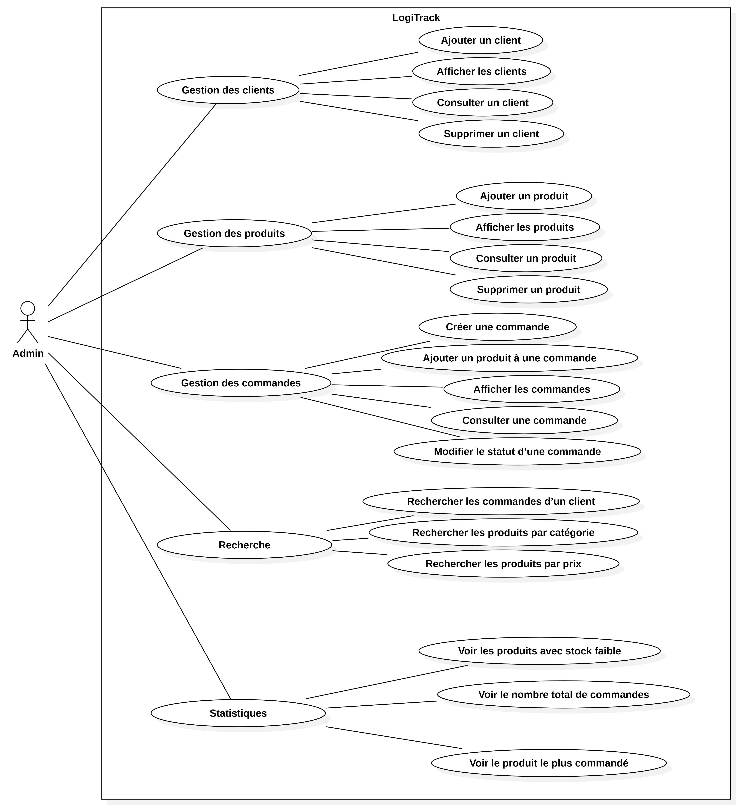
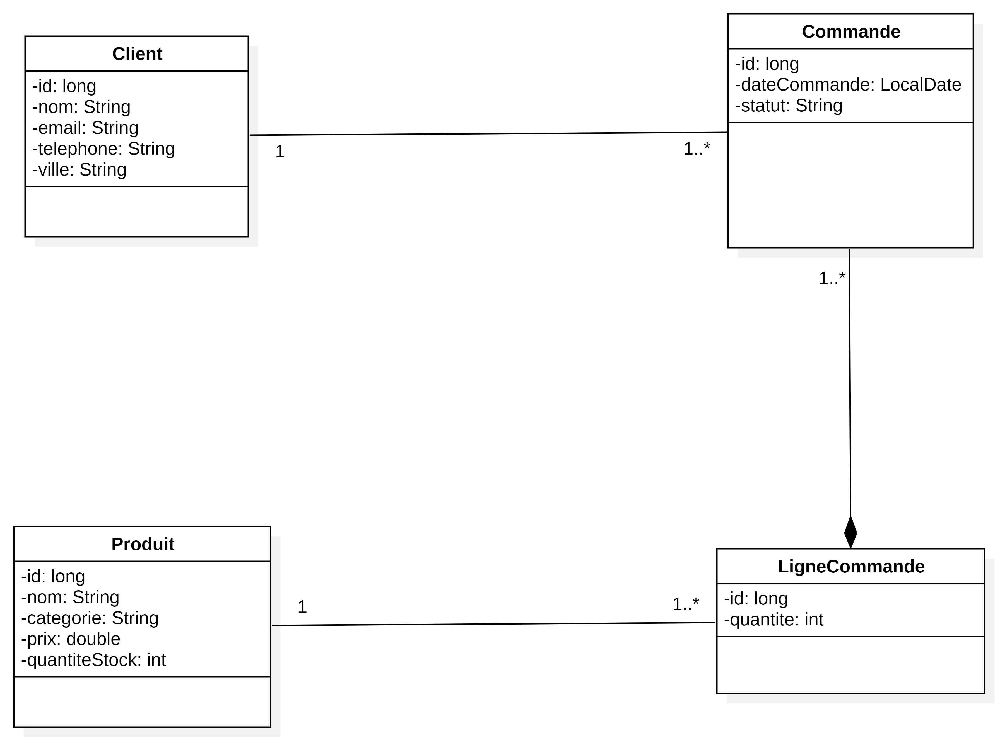

# 1. Nom du projet

**Nom du projet :** LogiTrack — API REST de gestion logistique (Backend Spring Boot)

---

# 2. Présentation du projet

Ce projet est une API REST développée avec Spring Boot et Spring Data JPA qui permet de gérer les clients, les produits et les commandes logistiques d'une entreprise, avec une authentification sécurisée par JWT et une gestion des droits basée sur les rôles.

Il s'adresse à l'entreprise **LogiTrack Solutions** et à ses équipes internes (administrateurs, managers, agents) qui doivent suivre et traiter les commandes entre les clients et l'entrepôt.

Son objectif principal est d'exposer des endpoints sécurisés permettant de créer, consulter, modifier et supprimer les clients, les produits et les commandes, tout en appliquant des règles d'accès différenciées selon le rôle de l'utilisateur connecté.

---

# 3. Problématique

Le problème identifié est que LogiTrack Solutions ne dispose pas d'un système centralisé et sécurisé permettant de gérer les commandes logistiques entre les clients et l'entrepôt, avec un contrôle d'accès adapté aux différents profils d'utilisateurs.

La solution proposée permet de mettre à disposition une API REST sécurisée par JWT, exposant les opérations de gestion des clients, des produits et des commandes, avec des permissions distinctes pour les rôles ADMIN, MANAGER et AGENT.

---

# 4. Fonctionnalités principales

- S'authentifier (inscription et connexion) et obtenir un token JWT
- Gérer les utilisateurs et leurs rôles (ADMIN, MANAGER, AGENT)
- Gérer les clients (créer, afficher, consulter, supprimer)
- Gérer les produits (créer, afficher, consulter, supprimer, rechercher par catégorie ou par prix)
- Gérer les commandes (créer, ajouter des produits, afficher, consulter, modifier le statut)
- Rechercher les commandes associées à un client
- Consulter les statistiques (produits en stock faible, nombre total de commandes, produit le plus commandé)

---

# 5. Technologies utilisées

| Technologie | Utilisation dans le projet |
|-------------|----------------------------|
| Java 17/21 | Langage de développement de l'application |
| Spring Boot | Framework principal de l'application |
| Spring Web | Exposition des endpoints REST |
| Spring Security & JWT | Authentification et sécurisation des routes selon le rôle |
| Spring Data JPA | Accès aux données et mapping objet-relationnel |
| MySQL | Base de données relationnelle |
| Maven | Gestion des dépendances et build du projet |
| Postman | Test manuel des endpoints de l'API |

> Nous avons utilisé **Spring Boot avec Spring Data JPA** pour construire une API REST structurée, **Spring Security couplé à JWT** pour sécuriser l'authentification et restreindre l'accès selon les rôles ADMIN, MANAGER et AGENT, et **MySQL** pour la persistance des données clients, produits et commandes.

---

# 6. Installation et lancement

## 6.1 Prérequis

Pour utiliser ce projet, vous devez disposer de :

- Java 17 ou 21
- Maven
- MySQL
- Postman (pour tester les endpoints)
- Un éditeur de code (IntelliJ IDEA ou VS Code)

## 6.2 Cloner le dépôt

```bash
git clone <URL_DU_DEPOT_A_COMPLETER>
```

## 6.3 Ouvrir le dossier

```bash
cd <NOM_DU_DOSSIER_A_COMPLETER>
```

## 6.4 Installer les dépendances

```bash
mvn clean install
```

## 6.5 Variables d'environnement

Configurer le fichier `application.properties` (ou `application.yml`) :

```env
spring.datasource.url=jdbc:mysql://localhost:3306/logitrack
spring.datasource.username=root
spring.datasource.password=
jwt.secret=
jwt.expiration=
```

### Point de vigilance

- Tester toutes les commandes
- Vérifier les chemins
- Ne jamais publier :
    - mots de passe
    - clés API
    - tokens
    - identifiants

## 6.6 Lancer le projet

```bash
mvn spring-boot:run
```

## 6.7 Ouvrir le projet

Après le lancement, l'API est accessible à l'adresse :

```
http://localhost:8080/api
```

---

# 7. Endpoints principaux

## Authentification

| Méthode | Endpoint | Description |
|---------|----------|--------------|
| POST | `/api/auth/register` | Inscription d'un utilisateur |
| POST | `/api/auth/login` | Connexion et récupération du JWT |

## Clients

| Méthode | Endpoint | Description |
|---------|----------|--------------|
| POST | `/api/clients` | Ajouter un client |
| GET | `/api/clients` | Afficher tous les clients |
| GET | `/api/clients/{id}` | Consulter un client |
| DELETE | `/api/clients/{id}` | Supprimer un client |

## Produits

| Méthode | Endpoint | Description |
|---------|----------|--------------|
| POST | `/api/products` | Ajouter un produit |
| GET | `/api/products` | Afficher tous les produits |
| GET | `/api/products/{id}` | Consulter un produit |
| DELETE | `/api/products/{id}` | Supprimer un produit |
| GET | `/api/products/category/{category}` | Rechercher les produits par catégorie |
| GET | `/api/products/price/{price}` | Rechercher les produits par prix |
| GET | `/api/products/low-stock` | Afficher les produits avec un stock faible |

## Commandes

| Méthode | Endpoint | Description |
|---------|----------|--------------|
| POST | `/api/orders` | Créer une commande pour un client |
| POST | `/api/orders/{orderId}/products` | Ajouter un produit à une commande |
| GET | `/api/orders` | Afficher toutes les commandes |
| GET | `/api/orders/{id}` | Consulter une commande |
| PUT | `/api/orders/{id}/status` | Modifier le statut d'une commande (`EN_ATTENTE`, `EXPEDIEE`, `LIVREE`) |
| GET | `/api/orders/client/{clientId}` | Rechercher les commandes d'un client |
| GET | `/api/orders/count` | Nombre total de commandes |

## Statistiques

| Méthode | Endpoint | Description |
|---------|----------|--------------|
| GET | `/api/statistics/top-product` | Produit le plus commandé |

---

# 8. Rôles et permissions

| Rôle | Permissions |
|------|-------------|
| **ADMIN** | Accède à toutes les fonctionnalités : gestion des utilisateurs, des clients, des produits, des commandes, suppression des données, consultation des statistiques |
| **MANAGER** | Gère les clients, les produits et les commandes, modifie le statut des commandes, consulte les statistiques et les produits en stock faible |
| **AGENT** | Consulte les clients, les produits, les commandes et leurs détails, modifie le statut d'une commande selon les autorisations définies |

> Règle simple à retenir : **ADMIN** administre l'application, **MANAGER** pilote les opérations, **AGENT** exécute et suit les tâches quotidiennes.

---

# 9. Modélisation et diagrammes

## Diagramme de cas d'utilisation



Ce diagramme présente les cas d'utilisation accessibles à l'acteur Admin dans l'application LogiTrack : la gestion des clients, des produits et des commandes, la recherche (par client, catégorie ou prix) et la consultation des statistiques (stock faible, nombre de commandes, produit le plus commandé).

## Diagramme de classes



Ce diagramme représente les entités principales du modèle de données :

- **Client** (id, nom, email, téléphone, ville) est associé à une ou plusieurs **Commande** (relation 1 à 1..*).
- **Commande** (id, dateCommande, statut) est composée d'une ou plusieurs **LigneCommande** (relation de composition 1..*).
- **Produit** (id, nom, catégorie, prix, quantitéStock) est référencé par une ou plusieurs **LigneCommande** (relation 1 à 1..*).
- **LigneCommande** (id, quantité) fait le lien entre une commande et un produit.

---

# 10. Contribution personnelle

Ma contribution principale a porté sur le développement de l'API REST avec Spring Boot, incluant la sécurisation par Spring Security et JWT.

J'ai également travaillé sur la modélisation des entités (Client, Produit, Commande, LigneCommande), la mise en place des relations JPA et la définition des permissions selon les rôles ADMIN, MANAGER et AGENT.

J'ai été responsable de l'implémentation des endpoints REST, des requêtes dérivées (*derived queries*) et des requêtes personnalisées (`@Query`) pour les statistiques.

> À personnaliser : adaptez ce texte si le projet a été réalisé en groupe.

---

# 11. Difficultés rencontrées

## Difficulté 1

### Texte final

J'ai rencontré le problème suivant : la mise en place de la sécurité avec Spring Security et JWT générait des erreurs d'accès inattendues sur certains endpoints publics comme `/api/auth/login`.

Pour comprendre l'origine du problème, j'ai analysé la configuration des filtres de sécurité et testé les requêtes avec Postman.

J'ai résolu le problème en configurant correctement les routes publiques dans la `SecurityFilterChain` et en excluant les endpoints d'authentification du filtre JWT.

Cette difficulté m'a permis d'apprendre à configurer précisément la chaîne de filtres de sécurité de Spring Security.

## Difficulté 2

### Texte final

J'ai rencontré le problème suivant : la définition des permissions par rôle (ADMIN, MANAGER, AGENT) sur les différents endpoints entraînait des conflits d'accès selon les cas d'utilisation.

Pour comprendre l'origine du problème, j'ai listé précisément les actions autorisées pour chaque rôle à partir du cahier des charges.

J'ai résolu le problème en utilisant les annotations `@PreAuthorize` sur chaque endpoint afin de restreindre l'accès selon le rôle attendu.

Cette difficulté m'a permis d'apprendre à appliquer un contrôle d'accès fin (*role-based access control*) dans une API Spring Boot.

---

# 12. Améliorations possibles

Dans une prochaine version, je pourrais :

- ajouter des tests unitaires et d'intégration (JUnit, Mockito) ;
- ajouter un système de rafraîchissement du token JWT (*refresh token*) ;
- documenter l'API avec Swagger / OpenAPI ;
- déployer l'application sur un environnement cloud.

### Conclusion

Ces améliorations permettraient de renforcer la fiabilité, la sécurité et la maintenabilité de l'API, tout en facilitant son intégration avec le frontend.